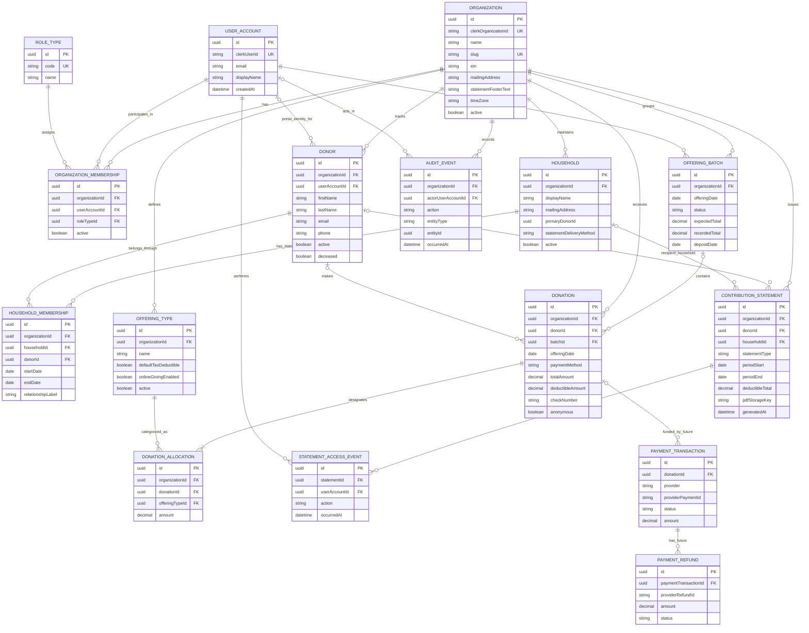

# BITS — Bring In The Sheaves
## Product and Technical Design Specification

**Document status:** Initial build specification  
**Target audience:** Product owner, AI-assisted developers using Cursor, technical reviewers  
**Initial deployment target:** Railway  
**Primary stack:** Next.js App Router, React, TypeScript, PostgreSQL, Prisma, Clerk, Tailwind CSS, shadcn/ui  
**Version:** 0.1 — May 2026

---

## 1. Product Overview

BITS (**Bring In The Sheaves**) is a multi-tenant web application that enables churches and similar charitable faith organizations to securely record charitable giving, manage donors and households, generate donor contribution statements, and later accept online donations.

The original BITS application was built in Meteor and tracked users, households, offering types, offerings, and reports. This new implementation reimagines the application as a modern Next.js monolith with a PostgreSQL relational data model, secure donor portal, role-based staff access, contribution reporting, and an explicit path to Stripe-powered online giving.

### 1.1 Product goals

1. Enable multiple churches to use one hosted application while keeping each organization’s data strictly isolated.
2. Allow staff to manage households, donors, offering types, batches, donations, and reports.
3. Allow donors with accounts to access only their own giving history and contribution statements.
4. Track donors who never need an online account, such as guests, occasional contributors, or benefactors.
5. Produce contribution statements suitable for supporting a donor’s tax recordkeeping needs.
6. Provide a clean audit trail for sensitive giving records and statement access.
7. Preserve a low-complexity monolithic application architecture that is approachable for a small, AI-assisted development team.
8. Design a clear expansion path for Stripe online and recurring giving without requiring a rewrite of the donation ledger.

### 1.2 Non-goals for version 1

The initial release does not include:

- Live Stripe checkout or recurring online payments.
- Refund/reversal processing, except as a defined future capability.
- Multi-factor authentication configuration beyond capabilities made available through the chosen authentication provider.
- Data deletion workflows.
- Advanced bank reconciliation or accounting-system integration.
- Quid pro quo event/ticket management beyond foundational reporting fields and future-design notes.

---

## 2. Key Product Decisions

| Area | Decision |
|---|---|
| Tenancy | Multi-tenant from version 1; all tenant-owned records are scoped by `organizationId`. |
| Organization | Each church is an `Organization` and may map to a Clerk Organization. |
| Authentication | Clerk is the default authentication provider; use Clerk Organizations and roles/permissions for tenant context and access controls. |
| Accounts vs donors | `UserAccount` and `Donor` are separate. A donor may exist without login credentials; a user account may be a staff account without being a donor. |
| Households | Donors may have one active household association at a time; household membership history is retained. |
| Gifts | A `Donation` represents a received gift or envelope/check/payment. |
| Offering types | Funds/designations are called `OfferingType` in the application. |
| Multiple envelope categories | A gift may contain one or more `DonationAllocation` line items. This supports an envelope specifying separate amounts for multiple offering types without creating duplicate payment/check records. |
| Batches | Version 1 includes offering batch/deposit workflow for data entry and reconciliation status. |
| Anonymous gifts | Aggregate anonymous donations may be entered, typically within an offering batch. |
| Statements | Both household and individual contribution statements are supported; PDFs are generated and archived. |
| Statements and access logs | Staff may see statement generation/download activity; donors may view/download their own statements. |
| Online giving | Stripe is planned for Phase 2. Data structures and service boundaries must accommodate it. |
| Deployment | Railway is the initial target for Next.js application and PostgreSQL service. |

---

## 3. Users and Personas

### 3.1 Platform administrator

A BITS operational administrator who provisions or supports church organizations. This role is optional in early builds but the architecture should not preclude it.

**Core needs:** create organizations, troubleshoot tenant onboarding, view application health without casually accessing giving details.

### 3.2 Organization administrator

A church administrator responsible for setting up the organization, managing staff roles, organization statement settings, offering types, and donor access.

**Core needs:** configure church profile, maintain staff access, configure offering types, run reports.

### 3.3 Treasurer / finance staff

A trusted staff user who handles donation entry, batches, statements, reporting, exports, and eventual refunds.

**Core needs:** efficient batch entry, report accuracy, statement generation, auditability.

### 3.4 Data-entry staff or volunteer

A restricted staff user who enters donations and batch information but should not necessarily see comprehensive reports or organization configuration.

**Core needs:** fast, low-error offering entry workflow.

### 3.5 Reporting/read-only staff

A staff member who can run or view reports but cannot modify donation records.

### 3.6 Donor portal user

An individual donor who has an authenticated account and can view their own recorded gifts, download their own statements, and later give online.

### 3.7 Unauthenticated donor

A person who donates but does not have an account. Staff record the donor and their gifts; statements can be printed or delivered outside the portal.

---

## 4. Functional Requirements

### 4.1 Tenant and organization management

**FR-ORG-001** The system shall support multiple organizations in one deployment.  
**FR-ORG-002** Tenant-owned data shall be associated with one organization and inaccessible across organization boundaries.  
**FR-ORG-003** An organization shall store its legal/display name, mailing address, tax identification number/EIN, contact email, contact phone, logo reference, statement footer/disclaimer text, time zone, locale, and active/inactive status.  
**FR-ORG-004** Organization administrators shall manage organization settings used on contribution statements.  
**FR-ORG-005** The application shall associate an organization with its Clerk Organization identifier when Clerk Organizations are enabled.

### 4.2 Authentication and authorization

**FR-AUTH-001** Staff and donor portal users shall authenticate through Clerk.  
**FR-AUTH-002** A user account may be linked to zero or one donor record per organization.  
**FR-AUTH-003** Staff permissions shall be determined by organization membership role.  
**FR-AUTH-004** A donor portal user shall only view their own donor profile, donations, and statements unless explicitly granted a staff role.  
**FR-AUTH-005** The system shall maintain application-side membership/audit records linked to Clerk user and organization identifiers.  
**FR-AUTH-006** Version 1 shall support roles: `ORG_ADMIN`, `TREASURER`, `DATA_ENTRY`, `REPORT_VIEWER`, and `DONOR`.  
**FR-AUTH-007** Platform administration, custom roles, and MFA policy enforcement are future enhancements unless required during deployment setup.

### 4.3 Donors and households

**FR-DONOR-001** Staff shall create and manage donors regardless of whether they have user accounts.  
**FR-DONOR-002** Donor fields shall include name, mailing address overrides when appropriate, email, phone, preferred communication method, active/inactive status, deceased flag/date where appropriate, and internal notes subject to permissions.  
**FR-DONOR-003** A donor may be linked to a portal user account later without altering historical donation records.  
**FR-HH-001** Staff shall create and manage households with shared mailing address, primary contact, preferred statement recipient, and preferred statement delivery method.  
**FR-HH-002** A donor shall have at most one active household membership at any point in time.  
**FR-HH-003** Household membership changes shall preserve start/end history to support accurate historical statements and audit review.  
**FR-HH-004** The system shall support either household or individual contribution statements.

### 4.4 Offering types

**FR-TYPE-001** Staff with configuration permission shall create, edit, deactivate, and list offering types, such as General Fund, Building Fund, Missions, and Benevolence.  
**FR-TYPE-002** An offering type shall specify whether contributions are normally tax-deductible and whether it is available for future online giving.  
**FR-TYPE-003** Historical donation allocations shall retain their offering-type association even after that type is deactivated.

### 4.5 Offering batches

**FR-BATCH-001** Staff shall create an offering batch for a service, collection, deposit grouping, or other entry session.  
**FR-BATCH-002** Batch fields shall include organization, batch name/reference, offering date, optional service/type description, status, expected total, recorded total, deposit date/reference, notes, creator, and timestamps.  
**FR-BATCH-003** The batch workflow shall support statuses `DRAFT`, `ENTERED`, `RECONCILED`, and `LOCKED`.  
**FR-BATCH-004** Users with permission shall enter identified and anonymous gifts in a batch.  
**FR-BATCH-005** The system shall calculate batch totals from donation allocations and warn when totals do not match the expected total.  
**FR-BATCH-006** Once locked, a batch shall not be silently edited; version-one implementation may restrict modification and defer formal adjustment entries to a future release.

### 4.6 Donations and allocations

**FR-DON-001** A donation represents one received gift, such as one envelope, check, cash gift, or future payment transaction.  
**FR-DON-002** Donation fields shall include organization, optional donor, optional batch, donation/offering date, received/entry date, payment method, total amount, optional check number, optional note, anonymous indicator, deductible status/amount, and audit timestamps.  
**FR-DON-003** Payment methods shall initially support `CASH`, `CHECK`, `CARD`, `ACH`, `STOCK_OR_NONCASH`, and `OTHER`. Card and ACH are reserved for future online giving or administrative records until Phase 2.  
**FR-DON-004** Identified donations shall be linked to a donor, not directly to a household. Household statements shall derive inclusion using the donor’s applicable household membership rules.  
**FR-DON-005** Anonymous aggregate gifts shall use no donor reference and shall be clearly marked anonymous.  
**FR-DON-006** Each donation shall contain at least one allocation to an offering type.  
**FR-DON-007** The sum of donation allocations shall equal the donation total.  
**FR-DON-008** A data-entry screen may present category amounts as envelope lines rather than exposing the technical term “allocation.”  
**FR-DON-009** Version 1 shall not silently delete or rewrite locked donation history. Audit events are required for material modifications before lock.

### 4.7 Contribution reporting and statements

**FR-REPORT-001** Authorized staff shall run contribution reports filtered by organization, date range, donor, household, offering type, batch, and payment method as appropriate.  
**FR-REPORT-002** Authorized staff shall export donor giving/report result data to CSV.  
**FR-STMT-001** The system shall generate annual or custom-date-range contribution statements for an individual donor or household.  
**FR-STMT-002** A donor portal user shall view and download only their authorized statements. For an individual linked to a household, access to a household statement must be explicitly defined by household contact/portal authorization rules.  
**FR-STMT-003** A statement shall include organization identity and mailing information, donor/household recipient identity and address, tax year/date range, qualifying contributions, statement total, generation date, and configured statement/disclaimer language.  
**FR-STMT-004** The system shall archive generated statement metadata and the immutable generated PDF or a durable storage reference.  
**FR-STMT-005** The system shall record statement generation, viewing, and download events for staff audit review.  
**FR-STMT-006** The statement model shall support deductibility and any goods/services acknowledgment text required by the organization’s reporting policy.

### 4.8 Audit logging

**FR-AUDIT-001** The system shall log create/update/status-change operations affecting organizations, donors, households, offering types, batches, donations, and statements.  
**FR-AUDIT-002** Audit events shall include organization, acting user, action, entity type, entity identifier, timestamp, and change metadata suitable for authorized review.  
**FR-AUDIT-003** Statement views and downloads shall be auditable.  
**FR-AUDIT-004** Audit data shall not be editable through ordinary application CRUD screens.

### 4.9 Future online giving provision

**FR-PAY-FUTURE-001** The schema and application services shall reserve a future relationship from a donation to a payment transaction.  
**FR-PAY-FUTURE-002** Phase 2 shall use Stripe for one-time and recurring online gifts.  
**FR-PAY-FUTURE-003** Donors shall choose an offering type during checkout.  
**FR-PAY-FUTURE-004** Weekly and monthly recurring giving shall be supported when recurring giving is implemented.  
**FR-PAY-FUTURE-005** The future design shall permit the donor to optionally cover processing fees, subject to organization configuration and Stripe implementation details.  
**FR-PAY-FUTURE-006** A donation shall only be created or finalized after authoritative successful-payment confirmation from Stripe webhooks.  
**FR-PAY-FUTURE-007** Future refunds shall be initiated or recorded through BITS and synchronized with Stripe, with audit records and statement-impact handling.

---

## 5. Compliance and Statement Design Considerations

BITS is not tax advice, and each church should confirm statement wording and recordkeeping practices with qualified advisors. The system should nevertheless support common United States charitable acknowledgment needs.

The IRS states that an acknowledgment for a single contribution of $250 or more must include the organization name, amount of monetary contribution, description of non-cash property where applicable, and information about whether goods or services were provided; if goods or services were provided, the acknowledgment must address their value or applicable intangible religious benefits. An annual summary may be used to substantiate multiple qualifying individual contributions. See: [IRS — Charitable contributions: Written acknowledgments](https://www.irs.gov/charities-non-profits/charitable-organizations/charitable-contributions-written-acknowledgments) and [IRS Publication 1771](https://www.irs.gov/pub/irs-pdf/p1771.pdf).

### 5.1 Version-one statement fields

The generated PDF should include:

- Organization legal name, address, EIN, contact information, and optional logo.
- Recipient name and mailing address; household or individual statement designation.
- Statement tax year or reporting period.
- Donation detail rows: date, offering type, payment method or generic gift reference where appropriate, deductible amount, and optional memo policy.
- Total deductible contribution amount for the statement period.
- The organization-configured acknowledgment statement, defaulting to wording such as “No goods or services were provided in exchange for these contributions, other than intangible religious benefits, if applicable.” The church must approve its actual wording.
- Statement generation date and statement identifier.

### 5.2 Schema provisions for reporting correctness

Although initial workflows will typically involve fully deductible monetary gifts, include fields that allow future use without corrupting historical reports:

- `Donation.isTaxDeductible`
- `Donation.deductibleAmount`
- `Donation.goodsOrServicesProvided`
- `Donation.goodsOrServicesDescription`
- `Donation.goodsOrServicesEstimatedValue`
- `Donation.intangibleReligiousBenefitsOnly`
- `OfferingType.defaultTaxDeductible`

The UI may hide goods/services fields unless a treasurer selects an exceptional donation/reporting case.

---

## 6. Application Navigation and Page Map

### 6.1 Public and authentication routes

| Route | Page | Access | Purpose |
|---|---|---|---|
| `/` | Landing page | Public | Product introduction or organization-specific entry point. |
| `/sign-in` | Sign in | Public | Clerk sign-in flow. |
| `/sign-up` | Sign up/invitation | Controlled | Donor portal sign-up or invitation flow. |
| `/select-organization` | Organization switcher | Authenticated staff where applicable | Select active church tenant. |

### 6.2 Donor portal routes

| Route | Page | Purpose |
|---|---|---|
| `/portal` | Donor dashboard | Summary of recorded year-to-date giving and available statements. |
| `/portal/gifts` | My gifts | Filtered list of donor’s own contributions and allocations. |
| `/portal/statements` | My statements | View/download statement PDFs available to the donor. |
| `/portal/profile` | My profile | View/update permitted contact information; household changes require staff review in v1. |
| `/portal/give` | Give online | Placeholder in v1; Stripe giving in Phase 2. |

### 6.3 Staff application routes

All staff routes are under the active organization context. The implementation may use `/app/...` with active Clerk organization or explicit `/org/[organizationSlug]/...` routes; explicit organization segments are recommended for clarity and testability.

| Route | Page | Primary roles |
|---|---|---|
| `/org/[slug]/dashboard` | Organization dashboard | Staff |
| `/org/[slug]/households` | Household list/search | Admin, Treasurer, Data Entry, Report Viewer |
| `/org/[slug]/households/new` | New household | Admin, Treasurer, Data Entry |
| `/org/[slug]/households/[id]` | Household detail, members, statements | Authorized staff |
| `/org/[slug]/donors` | Donor list/search | Authorized staff |
| `/org/[slug]/donors/new` | New donor | Admin, Treasurer, Data Entry |
| `/org/[slug]/donors/[id]` | Donor profile, gifts, household timeline | Authorized staff |
| `/org/[slug]/offering-types` | Offering type management | Admin, Treasurer |
| `/org/[slug]/batches` | Batch list | Admin, Treasurer, Data Entry |
| `/org/[slug]/batches/new` | Create batch | Admin, Treasurer, Data Entry |
| `/org/[slug]/batches/[id]/entry` | Fast gift entry screen | Admin, Treasurer, Data Entry |
| `/org/[slug]/batches/[id]/review` | Totals/reconcile/lock | Admin, Treasurer |
| `/org/[slug]/donations` | Donation search/detail | Authorized staff |
| `/org/[slug]/reports` | Report catalog | Admin, Treasurer, Report Viewer |
| `/org/[slug]/reports/giving` | Giving report | Admin, Treasurer, Report Viewer |
| `/org/[slug]/statements` | Generate/manage statements | Admin, Treasurer, Report Viewer subject to policy |
| `/org/[slug]/audit` | Audit history | Admin, Treasurer or restricted auditor role later |
| `/org/[slug]/settings` | Organization settings | Admin |
| `/org/[slug]/staff` | Staff memberships/roles | Admin |

### 6.4 Phase-two routes

| Route | Page | Purpose |
|---|---|---|
| `/portal/give` | Online gift checkout setup | Select offering type, amount, recurrence, optional fee coverage. |
| `/portal/recurring-gifts` | Recurring giving management | View/manage weekly/monthly giving plans. |
| `/org/[slug]/payments` | Payment transaction review | Stripe payment and webhook reconciliation. |
| `/org/[slug]/refunds` | Refund workflow | Initiate/record/refconcile refunds and statement impact. |

---

## 7. Role-Based Access Matrix

| Capability | Org Admin | Treasurer | Data Entry | Report Viewer | Donor |
|---|:---:|:---:|:---:|:---:|:---:|
| Manage organization settings | Yes | No | No | No | No |
| Manage staff roles | Yes | No | No | No | No |
| Manage offering types | Yes | Yes | Read | Read | No |
| Create/edit donors and households | Yes | Yes | Yes | Read | Own profile limited |
| Link donor portal account | Yes | Yes | No | No | No |
| Create/edit draft batches | Yes | Yes | Yes | Read | No |
| Reconcile/lock batch | Yes | Yes | No | No | No |
| Enter donations | Yes | Yes | Yes | No | No in v1 |
| View all giving data | Yes | Yes | As required for entry | Yes | Own only |
| Run reports | Yes | Yes | No by default | Yes | Own only |
| Generate statements | Yes | Yes | No | Optional/read-only | No |
| Download statements | Yes | Yes | No by default | Yes | Own authorized statements |
| Export CSV | Yes | Yes | No | Optional | Own export only if enabled |
| View audit records | Yes | Yes | No | No by default | No |
| Online giving | Future | Future admin | No | Read future | Future |
| Refund processing | Future | Future | No | Read future | No |

**Authorization invariant:** every staff operation must verify both authenticated identity and tenant membership/permission on the server. Hiding UI controls is not authorization.

---

## 8. Domain Model Overview

### 8.1 Important modeling decisions

1. **Authentication users are not donors.** A `UserAccount` exists because someone signs in; a `Donor` exists because a person’s charitable giving is tracked. An optional link handles a donor who later creates a portal account.
2. **Tenant isolation is explicit.** Every organization-owned business record includes `organizationId`, even where it could be derived indirectly, to simplify safe query guards and indexing.
3. **Household membership is historical.** A donor has at most one active household membership at a time, but membership history is stored so moves or family changes do not erase prior relationships.
4. **One donation may carry several envelope category lines.** A check or envelope can specify amounts for General Fund and Missions; it remains one `Donation`, with multiple `DonationAllocation` rows. This is not presented to users as a complex split-payment feature; it is faithful entry of one gift’s designated amounts.
5. **A statement is an archived snapshot.** Once generated and made available, a statement retains its PDF/storage reference and summary metadata rather than changing dynamically when data changes.
6. **Future payments are separate from donation ledger records.** Stripe transaction and refund lifecycle data should not be collapsed into the church’s contribution record.

---

## 9. Mermaid Entity Relationship Diagram

> Mermaid labels avoid parentheses to keep rendering compatible across Mermaid viewers.



---

## 10. Proposed Relational Entities

### 10.1 `Organization`

Represents one church tenant.

| Field | Type | Notes |
|---|---|---|
| `id` | UUID | Primary key. |
| `clerkOrganizationId` | string nullable unique | External auth organization linkage. |
| `name` | string | Display/legal name. |
| `slug` | string unique | URL tenant identifier. |
| `ein` | string nullable | Sensitive statement configuration field; protect access. |
| `mailingAddressLine1/2`, `city`, `state`, `postalCode`, `country` | string | Organization address. |
| `contactEmail`, `contactPhone` | string nullable | Public statement contact fields. |
| `logoUrl` or `logoStorageKey` | string nullable | PDF/branding use. |
| `statementFooterText` | text nullable | Church-approved statement wording. |
| `timeZone` | string | Defaults by organization. |
| `active` | boolean | Soft lifecycle control. |
| `createdAt`, `updatedAt` | timestamp | Standard metadata. |

### 10.2 `UserAccount`

Local application projection of a Clerk authenticated identity. Do not store passwords.

| Field | Type | Notes |
|---|---|---|
| `id` | UUID | Primary key. |
| `clerkUserId` | string unique | Clerk identifier. |
| `primaryEmail` | string | Display/contact and lookup. |
| `displayName` | string nullable | User-facing name. |
| `active` | boolean | Local access state, coordinated with Clerk. |
| `createdAt`, `updatedAt`, `lastSeenAt` | timestamp | Metadata. |

### 10.3 `RoleType` and `OrganizationMembership`

Application-side membership projection for access queries and audit readability. Clerk roles/permissions should be mapped consistently to these role codes.

| Role code | Purpose |
|---|---|
| `ORG_ADMIN` | Full organization configuration and staff management. |
| `TREASURER` | Giving ledger, batches, statements, reports, audits. |
| `DATA_ENTRY` | Donor and batch entry workflows. |
| `REPORT_VIEWER` | Read/report access only. |
| `DONOR` | Donor portal access to linked data. |

Membership constraints:

- Unique active membership per `organizationId` and `userAccountId` for a single role model; alternatively permit multiple roles with a composite unique constraint.
- Recommended MVP implementation: one role per member per organization to keep authorization simple.
- The authenticated Clerk organization must match the requested BITS organization for all tenant-scoped staff routes.

### 10.4 `Donor`

A person whose contributions are tracked. A donor need not be a portal user or church member.

Key fields include `organizationId`, optional `userAccountId`, names, contact details, preferred communication method, status, deceased indicators, and created/updated metadata. The donor record must remain available for historic reporting even if inactive or deceased.

### 10.5 `Household` and `HouseholdMembership`

`Household` stores shared statement/address preferences. `HouseholdMembership` associates a donor to a household over a time range.

**Constraint:** a donor may have no more than one membership with `endDate IS NULL` at a time within an organization. Implement this using application validation and, where practical, a PostgreSQL partial unique index created in a SQL migration.

**Statement policy decision required during implementation:** household statements for a period should generally include donations from donors who are current authorized members of that household and whose gifts should be attributed to the household under the church’s reporting practice. Because household transitions and tax filing choices can be nuanced, staff must be allowed to generate individual statements regardless of household membership.

### 10.6 `OfferingType`

The existing BITS terminology is retained. Example records: General Fund, Building Fund, Missions, Benevolence.

Recommended fields include `name`, `description`, `code`, `defaultTaxDeductible`, `onlineGivingEnabled`, `displayOrder`, and `active`.

### 10.7 `OfferingBatch`

A controlled entry and reconciliation grouping for offerings. The batch does not replace individual identified donations; it groups them.

Recommended state transition:

```text
DRAFT -> ENTERED -> RECONCILED -> LOCKED
```

- `DRAFT`: batch exists; entry ongoing.
- `ENTERED`: staff considers entry complete; total is ready for review.
- `RECONCILED`: authorized user has validated totals/deposit details.
- `LOCKED`: historical record should not be edited in ordinary workflows.

### 10.8 `Donation` and `DonationAllocation`

`Donation` holds gift-level information: donor identity if known, check/payment information, total, date, and deductibility fields. `DonationAllocation` holds the offering-category amounts written on an envelope or selected in future online giving.

Validation invariants:

- Donation amount must be positive in version 1.
- Donation must have at least one allocation.
- Allocation amounts must be positive.
- Sum of allocations must exactly equal `Donation.totalAmount`.
- `donorId` must be non-null unless `anonymous = true`.
- `checkNumber` is permitted/required by organization policy when payment method is `CHECK`.
- A locked batch prevents ordinary donation mutation.

### 10.9 `ContributionStatement`

Represents a generated and archived PDF statement. A statement is either for exactly one donor or one household, not both.

Recommended fields:

- `statementType`: `INDIVIDUAL` or `HOUSEHOLD`.
- `periodStart`, `periodEnd`, `taxYear` nullable for custom date ranges.
- `donorId` nullable, `householdId` nullable with XOR validation.
- `deductibleTotal` and statement summary metadata.
- `pdfStorageKey`, checksum/hash, `generatedByUserAccountId`, `generatedAt`.
- `status`: `GENERATED`, `PUBLISHED`, `VOIDED` for future correction flow.

### 10.10 `StatementAccessEvent`

Records `GENERATED`, `VIEWED`, `DOWNLOADED`, `EMAILED`, or future `VOIDED` activity. For privacy, donors see their statements but staff access/reporting visibility follows organization policy.

### 10.11 `AuditEvent`

Append-only application audit log. Sensitive field values should be minimized or redacted in audit metadata; log meaningful changes without copying full private data unnecessarily.

### 10.12 Future `PaymentTransaction`, `RecurringGivingPlan`, and `PaymentRefund`

These models belong in Phase 2 migrations unless the implementation team explicitly decides to scaffold dormant tables in version 1. Their conceptual relationship is defined now so the donation ledger does not need redesign.

---

## 11. Multi-Tenant Architecture and Data Isolation

### 11.1 Tenancy model

Use a shared PostgreSQL database and shared tables, with row-level tenant scoping by `organizationId`. This is an appropriate initial balance of simplicity, operating cost, and feature velocity for small/medium church tenants.

### 11.2 Clerk organization mapping

Recommended mapping:

- Clerk `Organization` corresponds one-to-one with BITS `Organization` using `clerkOrganizationId`.
- Clerk organization memberships/roles establish authenticated tenant context and high-level permissions.
- BITS stores local `OrganizationMembership` projection for business rules, reporting, and audit history.
- A server-side organization resolver maps `[slug]` to an organization and verifies it matches the active/authorized Clerk organization context before any business query executes.

### 11.3 Required isolation safeguards

Every tenant-scoped query and mutation must:

1. Resolve the active authenticated user.
2. Resolve and authorize the active organization.
3. Scope the database operation by `organizationId` in addition to record identifier.
4. Verify role permission before mutation or sensitive read.
5. Create audit records for protected operations.

Do not use patterns such as `findUnique({ where: { id } })` for tenant-owned records unless tenant authorization is independently and securely proven; prefer compound tenant-aware lookups such as `where: { id, organizationId }` or helper repository functions that enforce scope.

### 11.4 Future defense-in-depth option

After application behavior stabilizes, consider PostgreSQL row-level security as additional defense-in-depth. Do not make it a prerequisite for first delivery if it would impede AI-assisted implementation and testing; tenant-scoped server-side repositories and tests are mandatory regardless.

---

## 12. Technical Architecture

### 12.1 Architectural style

BITS shall be a **modular monolith**: one Next.js application and one PostgreSQL database, organized internally by domain modules. No independent backend service or microservices are required for initial delivery.

### 12.2 Default technology stack

| Concern | Default selection | Notes |
|---|---|---|
| Full-stack framework | Next.js App Router with TypeScript | React frontend and server-side logic in one application. |
| UI | React, Tailwind CSS, shadcn/ui | Accessible administrative screens and portal. |
| Database | PostgreSQL | Relational financial/reporting model. |
| ORM/migrations | Prisma ORM and Prisma Migrate | Readable data model and AI-friendly type-safe client. |
| Authentication | Clerk with Organizations | Authenticated users, tenant organization context, staff/donor role support. |
| Input validation | Zod | Shared validation schemas for UI and server operations. |
| Forms | React Hook Form plus server actions or route handlers | Team may override based on generated implementation. |
| Reports/PDF | Server-side PDF generation, implementation selected during build | Store immutable output in durable object storage. |
| File/object storage | Railway-compatible S3-style storage provider or Cloudflare R2/S3 | Decide before statement PDF publishing. |
| Testing | Vitest plus Playwright | Unit/domain tests and end-to-end authorization workflows. |
| Hosting | Railway | Deploy app from GitHub and attach PostgreSQL. |
| Payments Phase 2 | Stripe Checkout/Billing plus verified webhooks | One-time and weekly/monthly recurring giving. |

### 12.3 Next.js structure

Use the App Router. Recommended top-level organization:

```text
src/
  app/
    (public)/
    (auth)/
    portal/
    org/[slug]/
      dashboard/
      donors/
      households/
      offering-types/
      batches/
      donations/
      reports/
      statements/
      settings/
      staff/
      audit/
    api/
      webhooks/
        clerk/
        stripe/                 # Phase 2
  components/
    ui/
    layout/
    donors/
    households/
    offerings/
    reports/
  domains/
    organizations/
    authorization/
    donors/
    households/
    offering-types/
    batches/
    donations/
    statements/
    audits/
    payments/                   # Phase 2 boundary
  lib/
    db/
    auth/
    validation/
    money/
    storage/
    pdf/
  server/
    repositories/
    services/
    policies/
prisma/
  schema.prisma
  seed.ts
tests/
  e2e/
  integration/
```

### 12.4 Server mutations and API boundaries

Use server-side service functions for business operations. Server Actions may be used for trusted application form submissions, while Route Handlers should be used for external integrations, PDF/download endpoints when needed, CSV export, and future Stripe/Clerk webhooks.

Every exported Server Action or Route Handler must independently validate:

- Authenticated session where required.
- Organization scope.
- Permission.
- Input schema.
- Domain invariants.

Next.js documentation notes that Server Functions/Actions can be reached by direct POST requests and must perform their own authorization checks. See [Next.js Authentication guide](https://nextjs.org/docs/app/guides/authentication) and [Data Security guide](https://nextjs.org/docs/app/guides/data-security).

---

## 13. Key Workflows

### 13.1 Organization onboarding

1. Platform or onboarding flow creates a Clerk Organization.
2. Create matching BITS `Organization` record with `clerkOrganizationId` and slug.
3. Assign founding user as `ORG_ADMIN` membership.
4. Organization administrator completes church profile, EIN, address, statement language, and logo.
5. Administrator configures initial offering types.
6. Administrator invites treasurer/data-entry staff as needed.

### 13.2 Donor without portal account

1. Authorized staff opens Donors and creates a donor record.
2. Staff enters contact/address details and optionally adds donor to a household.
3. Gifts are recorded against the donor.
4. Staff generates statement PDF and delivers outside portal or later sends an invitation.

### 13.3 Donor portal linking

1. Donor is invited or signs up according to organization policy.
2. Authorized staff or a verified invitation workflow associates `UserAccount` with the correct existing `Donor` record.
3. Donor gains access to their own gift history and available published statements.
4. All linking actions are audited.

Avoid automatically linking a donor record solely by email without an appropriately verified invitation/claim workflow, because a mistaken association exposes giving data.

### 13.4 Household management

1. Staff creates household with shared mailing address and delivery preferences.
2. Staff associates donors through `HouseholdMembership` start dates.
3. To move a donor, staff ends current active membership and creates a new membership.
4. Historic membership remains queryable.
5. Staff can generate either household or individual statements as permitted by organization policy.

### 13.5 Offering batch and donation entry

1. Data-entry or finance user creates a `DRAFT` batch for a service/collection date.
2. User enters identified donor gifts, including payment method/check number and one or more offering-type amounts.
3. User enters anonymous aggregate cash gift when applicable.
4. Application continuously displays entered totals by offering type, payment method, and grand total.
5. User marks batch `ENTERED`.
6. Treasurer compares total against expected/deposit total and marks `RECONCILED`.
7. Treasurer locks finalized batch; ordinary editing is disabled.
8. All status changes are audited.

### 13.6 Contribution statement generation

1. Staff chooses tax year/date range and individual or household recipient.
2. Application displays qualifying donation preview and total.
3. Staff confirms statement configuration/text.
4. Application creates a PDF snapshot and `ContributionStatement` record.
5. Application stores an audit/access event for generation.
6. Statement may be published to donor portal if the recipient has authorized portal access.
7. Download events are recorded.

### 13.7 Phase-two online donation

1. Authenticated donor selects offering type, amount, one-time or weekly/monthly recurrence, and optional processing-fee coverage if enabled.
2. BITS initiates Stripe-hosted payment/checkout workflow without handling raw payment card data itself.
3. Stripe confirms payment asynchronously through a verified webhook event.
4. BITS processes webhook idempotently and records/finalizes a `Donation` only after successful payment confirmation.
5. A linked `PaymentTransaction` stores Stripe identifiers and statuses required for reconciliation and refunds.
6. Treasurer may later initiate/record a refund through BITS; Stripe result updates both payment and contribution/reporting state according to policy.

Stripe documentation identifies webhooks as the mechanism for asynchronous payment outcomes, including recurring payment success and refunds; implementation must verify events and handle duplicate delivery idempotently. See [Stripe Webhooks](https://docs.stripe.com/webhooks), [Stripe Payment Status Updates](https://docs.stripe.com/payments/payment-intents/verifying-status), and [Stripe Refunds](https://docs.stripe.com/refunds).

---

## 14. Reports and Exports

### 14.1 Version-one report catalog

| Report | Filters | Output |
|---|---|---|
| Giving by donor | Period, donor, offering type | Screen, CSV |
| Giving by household | Period, household | Screen, CSV, statement workflow |
| Giving by offering type | Period, offering type | Screen, CSV |
| Donation detail | Period, batch, payment method, donor | Screen, CSV |
| Offering batch reconciliation | Batch/date/status | Screen, printable view |
| Annual contribution statements | Tax year, individual/household, published state | PDF per statement; batch generation future or optional v1 |
| Statement access audit | Statement, donor/household, date, actor/action | Screen, CSV restricted |

### 14.2 CSV export guidelines

- Exports must be tenant-scoped and permission-protected.
- Export action should be audited for sensitive donor/giving exports.
- Avoid exporting protected data not necessary for the report; EIN is generally a statement field, not a donor export field.
- Donor self-export, when enabled, includes only that donor’s own giving data.

---

## 15. Non-Functional Requirements

### 15.1 Security and privacy

- Authenticate through Clerk; store no application passwords.
- Require server-side tenant and role authorization for protected reads and writes.
- Never expose donor giving data across tenants or between unrelated donors.
- Encrypt transport using HTTPS in deployed environments.
- Treat EIN, addresses, contact details, and giving data as sensitive data.
- Do not store raw card or bank-account payment credentials; defer payment entry to Stripe-hosted flows in Phase 2.
- Apply least privilege to database/storage and deployment environment variables.
- Record sensitive access/audit activity as specified.

### 15.2 Data integrity

- Monetary values shall use decimal/numeric database types; do not store money as floating point.
- All tenant-owned data shall include tenant scope.
- Database transactions shall be used when recording donation plus allocations, locking batches, generating statement metadata, and eventually processing payment webhooks.
- Generated statements shall be immutable snapshots; corrected records require regenerated/replacement statement workflows rather than silently changing a delivered PDF.

### 15.3 Usability

- Data entry should be optimized for keyboard usage and repetitive weekly batch workflows.
- Screens should clearly distinguish donors, households, offering types, batches, donations, and statements.
- Portal UI should be simple and privacy-conscious.
- Validation messages should explain correction actions without exposing internal technical details.

### 15.4 Maintainability

- Use explicit domain service boundaries and shared authorization policies rather than ad hoc logic in components.
- Keep Prisma schema and migrations under source control.
- Provide seed data for development and demos.
- Use automated tests for core financial invariants and tenant authorization.

### 15.5 Availability and operations

- Version 1 may be deployed as one Railway web service and one managed PostgreSQL service, with separate durable object storage selected for archived PDFs.
- Configure backups for PostgreSQL and archived statement artifacts before real donor data is entered.
- Keep separate development/test and production deployments/databases.

---

## 16. Validation Rules and Business Invariants

| Rule | Enforcement point |
|---|---|
| Every tenant-owned row belongs to an organization | Prisma schema plus service creation logic and database constraints. |
| User must be authorized in active organization | Server-side authorization policy on each protected operation. |
| Donor with portal access must be explicitly linked to account | Staff/invitation workflow and audit. |
| At most one active household membership per donor | Service validation plus partial unique database index where feasible. |
| Donation total equals allocations total | Server transaction validation; integration tests. |
| Anonymous donation has no donor; identified donation has donor | Server validation and database check where feasible. |
| Locked batch cannot be casually edited | Domain service permission/status checks. |
| Statement has either household or donor recipient | Server validation and database check. |
| Donor portal cannot view another donor’s statement | Server query scope and end-to-end authorization tests. |
| Online payment donation is finalized only after verified success | Phase-two webhook service and idempotency keys. |

---

## 17. Seed Data for Development

Provide deterministic development seed data in `prisma/seed.ts`:

### Organization

- Grace Community Church — fictional organization with fictional EIN/address and configured statement footer.

### Offering types

- General Fund
- Building Fund
- Missions
- Benevolence

### Users and roles

- Organization administrator
- Treasurer
- Data-entry user
- Report viewer
- Portal donor user

Use Clerk test users or documented local/test identifiers; never commit production Clerk identifiers or credentials.

### Households and donors

- Smith Household with two donors and shared address.
- Jordan Taylor as an individual donor with portal account.
- Morgan Lee as a donor without account.
- One inactive donor retained for historic reporting.

### Batch and gifts

- One draft weekly batch.
- One locked historic batch containing:
  - Identified check donation with one offering category.
  - Identified envelope with amounts to General Fund and Missions represented as two allocations under one donation.
  - Anonymous aggregate cash gift.

### Statements

- One archived individual statement and one household statement PDF placeholder/storage fixture.

---

## 18. Testing Strategy and Acceptance Criteria

### 18.1 Unit and domain tests

- Donation allocation totals must equal donation total.
- Household membership active-period validation.
- Statement recipient XOR validation.
- Statement total calculation for tax-deductible gifts.
- Batch status transition rules.
- Permission policy evaluation by role.

### 18.2 Integration tests

- Prisma creation/query of organization-scoped donors, batches, donations, allocations, and statements.
- Attempt to read/update a record using wrong `organizationId` must fail.
- PDF generation metadata and stored artifact reference.
- Audit event generated after protected actions.

### 18.3 End-to-end tests with Playwright

1. Organization administrator can configure offering types and invite/manage staff membership.
2. Data-entry user can create batch and enter donor/anonymous donations but cannot generate restricted reports or change organization settings.
3. Treasurer can reconcile and lock batch, generate statements, and see statement access activity.
4. Donor portal user can see only their own gifts/statements.
5. Donor portal user cannot access another donor’s statement URL by manipulating identifiers.
6. Staff from organization A cannot access data for organization B.
7. CSV export is scoped and audited.

### 18.4 Version-one completion criteria

Version 1 is complete when:

- Two seeded organizations can coexist and tenant isolation tests pass.
- Clerk authentication and role-protected routes work for staff and donor portal users.
- Household/donor/offering-type maintenance is usable.
- Batch entry supports identified and anonymous donations with offering category lines.
- Contribution reports and PDF statements work for individuals and households.
- Statement PDFs and access audit records persist.
- Railway deployment and production environment configuration are documented.
- Automated tests cover financial invariants and critical authorization boundaries.

---

## 19. Delivery Phases and Suggested Backlog

### Phase 0 — Repository and architecture foundation

- Create Next.js TypeScript repository.
- Configure Tailwind/shadcn/ui, ESLint, formatting, environment validation, testing.
- Configure Prisma/PostgreSQL and initial migrations.
- Integrate Clerk and organization context.
- Establish authorization policy helpers, domain/service/repository conventions, audit helper.
- Configure Railway development/test deployment.

### Phase 1A — Organization, staff, donors, and households

- Organization profile/settings.
- Clerk organization mapping and role permissions.
- Staff membership screens.
- Donor CRUD and portal-account linking flow.
- Household CRUD and membership history workflow.
- Offering type management.

### Phase 1B — Donation ledger and batch entry

- Batch creation/list/status transitions.
- Fast entry screen for identified/anonymous donations.
- Donation and allocation validation.
- Review/reconcile/lock workflow.
- Audit records and basic dashboards.

### Phase 1C — Reports and donor portal

- Giving reports with CSV export.
- Statement PDF generation and archived artifact storage.
- Individual/household statement workflows.
- Donor portal dashboard, gifts, statements.
- Statement download/audit tracking.

### Phase 1D — Hardening and launch preparation

- End-to-end multi-tenant and authorization testing.
- Accessibility/security review.
- Backup and retention procedures.
- Production deployment runbook.
- Staff workflow documentation.

### Phase 2 — Online giving and payment lifecycle

- Stripe hosted checkout/payment design.
- Offering-type choice during checkout.
- One-time giving.
- Weekly/monthly recurring giving.
- Optional fee coverage.
- Verified/idempotent webhook processing.
- Payment transactions and BITS-initiated refund workflow.
- Statement impacts of refunds/reversals.

### Future enhancements

- MFA policy enforcement for privileged staff.
- Bulk statement generation and email delivery.
- Formal correction/adjustment ledger for locked batches.
- Bank deposit reconciliation/accounting integrations.
- Data deletion/privacy workflow.
- More sophisticated goods/services and noncash-gift workflows.
- Platform-level tenant provisioning/billing if BITS becomes a hosted product.

---

## 20. Cursor-Oriented Implementation Instructions

### 20.1 Working agreement for AI-assisted builders

Before generating broad application code, commit this design document in `docs/bits-design-spec.md` and ask Cursor to implement one scoped vertical slice at a time. Require Cursor to preserve tenant scope, authorization, audit logging, and tests in every feature slice.

Suggested repository documentation:

```text
docs/
  bits-design-spec.md
  decisions/
    ADR-001-modular-monolith-nextjs-postgres.md
    ADR-002-multitenancy-clerk-organizations.md
    ADR-003-donation-allocation-ledger.md
    ADR-004-statement-snapshot-storage.md
AGENTS.md
README.md
```

`AGENTS.md` should summarize non-negotiable rules:

- Do not bypass organization-scoped repositories/services.
- Do not rely on UI hiding for authorization.
- Do not use floating point for money.
- Do not update locked financial batches without a defined adjustment approach.
- Do not let donors retrieve data not explicitly linked/authorized to them.
- Write tests for every permission and financial invariant affected by a change.

### 20.2 Initial Cursor prompt — scaffold architecture

```text
You are helping implement BITS, a multi-tenant church charitable-giving application.
Read docs/bits-design-spec.md completely before changing code.

Create the initial application foundation using:
- Next.js App Router with TypeScript and src/ directory
- Tailwind CSS and shadcn/ui-compatible structure
- PostgreSQL with Prisma ORM and migrations
- Clerk authentication with Clerk Organizations as tenant identity context
- Zod validation
- Vitest and Playwright setup

Implement only Phase 0 foundations:
1. Recommended folder structure from the design spec.
2. Prisma models for Organization, UserAccount, RoleType, OrganizationMembership, Donor, Household, HouseholdMembership, OfferingType, OfferingBatch, Donation, DonationAllocation, ContributionStatement, StatementAccessEvent, and AuditEvent. Keep Phase 2 payment entities documented but do not implement payment behavior yet.
3. Tenant-scoped server helpers and authorization policy interfaces.
4. Environment variable validation and setup documentation.
5. Seed script containing two organizations and sample records demonstrating tenant separation.
6. Unit tests for donation-allocation total validation, statement recipient rules, and active household membership rules.

Before writing code, produce a concise implementation plan and list any schema decisions requiring confirmation. Do not invent shortcuts that weaken organization isolation, authorization, or financial record integrity.
```

### 20.3 Cursor prompt — donor and household vertical slice

```text
Read docs/bits-design-spec.md and current Prisma schema.
Implement the Phase 1A donor and household vertical slice.

Requirements:
- Staff routes under /org/[slug]/donors and /org/[slug]/households.
- Tenant authorization enforced server-side for every load and mutation.
- Donor CRUD supporting donors without accounts and optional later portal linking.
- Household CRUD with one shared address, primary contact, preferred statement recipient, and delivery preference.
- HouseholdMembership history: a donor may have at most one active household membership at a time; moving a donor closes the prior membership and creates a new one atomically.
- Audit events for create/update/link/move actions.
- Accessible tables/forms with validation errors.
- Tests proving organization A cannot read or modify organization B records.

Do not implement donations or reports in this slice except fixtures needed for tests.
```

### 20.4 Cursor prompt — batch donation entry vertical slice

```text
Read docs/bits-design-spec.md.
Implement offering types, offering batches, donations, and donation allocations.

Key rule: One Donation represents one gift or envelope/check. DonationAllocation line items represent offering-category amounts written on an envelope; the sum must exactly equal Donation.totalAmount.

Requirements:
- OfferingType administration for Org Admin and Treasurer.
- Batch create/list/detail/entry/review workflow with DRAFT, ENTERED, RECONCILED, LOCKED states.
- Fast batch-entry UI for identified donor gifts and anonymous aggregate cash gifts.
- Support CASH, CHECK, CARD, ACH, STOCK_OR_NONCASH, OTHER; require/check checkNumber rules where appropriate.
- Allow one or multiple offering-type amounts per gift.
- Prevent ordinary edits after batch LOCKED.
- Create audit events for financial creation/update/status transitions.
- Unit, integration, and Playwright tests for money totals, role permissions, tenant isolation, and locked records.

Use Decimal-safe calculations; never JavaScript floating-point arithmetic for financial totals.
```

### 20.5 Cursor prompt — reports and statements vertical slice

```text
Read docs/bits-design-spec.md, especially the compliance and statement sections.
Implement reports, PDF contribution statements, archived statement metadata, portal access, and access audit events.

Requirements:
- Staff reports: giving by donor, household, offering type, donation detail, and batch reconciliation.
- Permission-protected CSV exports.
- Generate individual or household contribution statements for a tax year or period.
- Statement previews must show included deductible gifts and total before generation.
- Generate immutable PDF snapshot and store durable artifact reference plus checksum/metadata.
- Store StatementAccessEvent records for generation, view, and download.
- Donor portal pages for own gifts and published statements only.
- Tests proving donor and tenant privacy boundaries.

Use church-configured statement wording; do not claim tax compliance beyond supporting configured acknowledgment fields.
```

### 20.6 Cursor prompt — Phase 2 Stripe integration when authorized

```text
Read docs/bits-design-spec.md and implement only Phase 2 online giving after Phase 1 is stable.
Use Stripe official recommended hosted-payment patterns and verified webhooks.

Requirements:
- One-time and weekly/monthly recurring giving.
- Donor selects one offering type during checkout initially.
- Optional donor processing-fee coverage controlled by organization configuration.
- Do not create/finalize a charitable Donation until verified successful-payment webhook processing.
- Webhook handling must be idempotent and tenant-safe.
- Implement PaymentTransaction, RecurringGivingPlan, and PaymentRefund with audit logging.
- Refunds initiated/recorded in BITS must reconcile with Stripe and define statement impacts.
- Never store raw card/bank credentials.
- Add comprehensive payment lifecycle and webhook replay tests.
```

---

## 21. Deployment and Operations Plan

### 21.1 Railway initial deployment

Recommended deployment layout:

- Railway service: Next.js BITS application built from GitHub repository.
- Railway PostgreSQL database service connected by environment variable.
- External durable file/object storage for immutable statement PDFs, selected before production statement use.
- Separate Railway projects or isolated services/databases for development/test and production.

Railway documents deploying a Next.js application from a GitHub repository and attaching a PostgreSQL database service. See [Deploy a Next.js App with Postgres — Railway](https://docs.railway.com/guides/nextjs) and [PostgreSQL — Railway](https://docs.railway.com/databases/postgresql).

### 21.2 Environment variables to define

Exact names may change during implementation; likely categories include:

```text
DATABASE_URL
DIRECT_URL                         # if required for migrations/provider behavior
NEXT_PUBLIC_CLERK_PUBLISHABLE_KEY
CLERK_SECRET_KEY
CLERK_WEBHOOK_SECRET
NEXT_PUBLIC_CLERK_SIGN_IN_URL
NEXT_PUBLIC_CLERK_SIGN_UP_URL
APP_BASE_URL
STATEMENT_STORAGE_BUCKET
STATEMENT_STORAGE_REGION
STATEMENT_STORAGE_ACCESS_KEY_ID
STATEMENT_STORAGE_SECRET_ACCESS_KEY
STRIPE_SECRET_KEY                  # Phase 2
STRIPE_WEBHOOK_SECRET              # Phase 2
NEXT_PUBLIC_STRIPE_PUBLISHABLE_KEY # Phase 2
```

### 21.3 Pre-production checklist

- Confirm tenant isolation with two real test organizations.
- Confirm production Clerk configuration, organization roles, invitations, and permitted portal flows.
- Confirm backup policy and restoration exercise for Postgres.
- Confirm PDF artifact storage retention, private access, signed-download behavior, and backup/retention needs.
- Confirm church-approved statement wording and EIN/address rendering.
- Confirm audit logging behavior for statement downloads and CSV exports.
- Complete security review before importing real giving data.

---

## 22. Open Decisions for Implementation Refinement

These issues do not block creation of the application foundation but should be resolved before relevant functionality ships:

1. **Household statement attribution policy:** how household moves during a tax year affect statement inclusion; whether staff explicitly select members at generation time.
2. **Donor access to household statements:** whether only the primary household contact can view/download them, or whether authorized adult household members may do so.
3. **PDF generation/storage library:** select and validate a solution compatible with Railway runtime and private object storage.
4. **Statement replacement policy:** how a regenerated or corrected statement is labeled and whether prior published statements remain visible as voided/superseded.
5. **Data-entry correction workflow:** before Phase 2, decide whether unlocked edits plus audit are sufficient or whether formal adjustments should be introduced earlier.
6. **Anonymous cash reporting:** determine presentation in batch reports and whether it is excluded from donor contribution statements by definition.
7. **Non-cash and goods/services workflow:** define UI and review requirements before using these fields in real reporting scenarios.
8. **Donor export policy:** whether donor self-service CSV export ships in version 1 or staff export is sufficient initially.
9. **Clerk invitation/linking process:** determine safe operational flow to match a new portal account to an existing donor record.
10. **Object storage provider:** select durable private storage for PDF snapshots before production deployment.

---

## 23. Source References for Implementation

These references are intended for builders to consult at implementation time; always verify current provider guidance before deployment.

- [Next.js App Router Documentation](https://nextjs.org/docs/app)
- [Next.js Authentication Guide](https://nextjs.org/docs/app/guides/authentication)
- [Next.js Data Security Guide](https://nextjs.org/docs/app/guides/data-security)
- [Clerk Organizations for Next.js](https://clerk.com/docs/nextjs/guides/organizations/getting-started)
- [Clerk Multi-tenant Architecture](https://clerk.com/docs/guides/how-clerk-works/multi-tenant-architecture)
- [Prisma Documentation](https://www.prisma.io/docs)
- [Prisma Seeding](https://www.prisma.io/docs/orm/prisma-migrate/workflows/seeding)
- [Railway Deploy a Next.js App with Postgres](https://docs.railway.com/guides/nextjs)
- [Railway PostgreSQL](https://docs.railway.com/databases/postgresql)
- [Stripe Webhooks](https://docs.stripe.com/webhooks)
- [Stripe Refunds](https://docs.stripe.com/refunds)
- [IRS Charitable Contributions Written Acknowledgments](https://www.irs.gov/charities-non-profits/charitable-organizations/charitable-contributions-written-acknowledgments)
- [IRS Publication 1771 — Charitable Contributions Substantiation and Disclosure Requirements](https://www.irs.gov/pub/irs-pdf/p1771.pdf)

---

## 24. Summary Recommendation

Proceed with BITS as a modular Next.js monolith deployed initially on Railway, using PostgreSQL and Prisma for an explicit relational ledger, Clerk Organizations for authenticated multi-tenant context, and strict server-side tenant/role authorization. Build the administrative giving ledger, donor portal, batch workflow, reporting, and immutable statement PDFs first. Model gifts and offering-category amounts accurately through `Donation` and `DonationAllocation` so Phase 2 Stripe online giving and refunds can be added without redesigning the contribution ledger.
